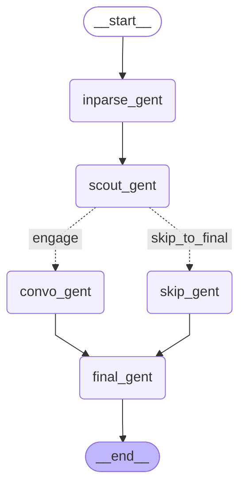

# agentJ Architecture

```mermaid
---
config:
  flowchart:
    curve: linear
---
graph TD;
	__start__([<p>__start__</p>]):::first
	inparse_gent(inparse_gent)
	scout_gent(scout_gent)
	convo_gent(convo_gent)
	skip_gent(skip_gent)
	final_gent(final_gent)
	__end__([<p>__end__</p>]):::last
	__start__ --> inparse_gent;
	convo_gent --> final_gent;
	inparse_gent --> scout_gent;
	scout_gent -. &nbsp;engage&nbsp; .-> convo_gent;
	scout_gent -. &nbsp;skip_to_final&nbsp; .-> skip_gent;
	skip_gent --> final_gent;
	final_gent --> __end__;
	classDef default fill:#f2f0ff,line-height:1.2
	classDef first fill-opacity:0
	classDef last fill:#bfb6fc

```
